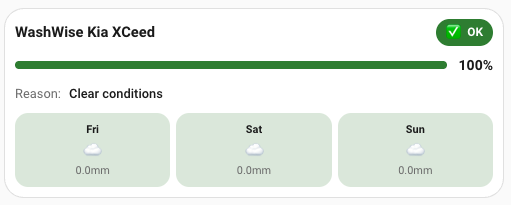
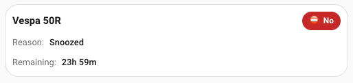
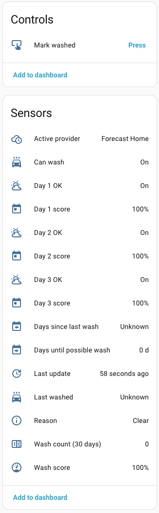
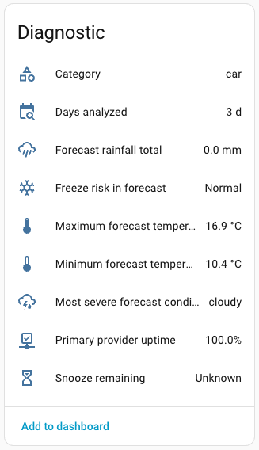
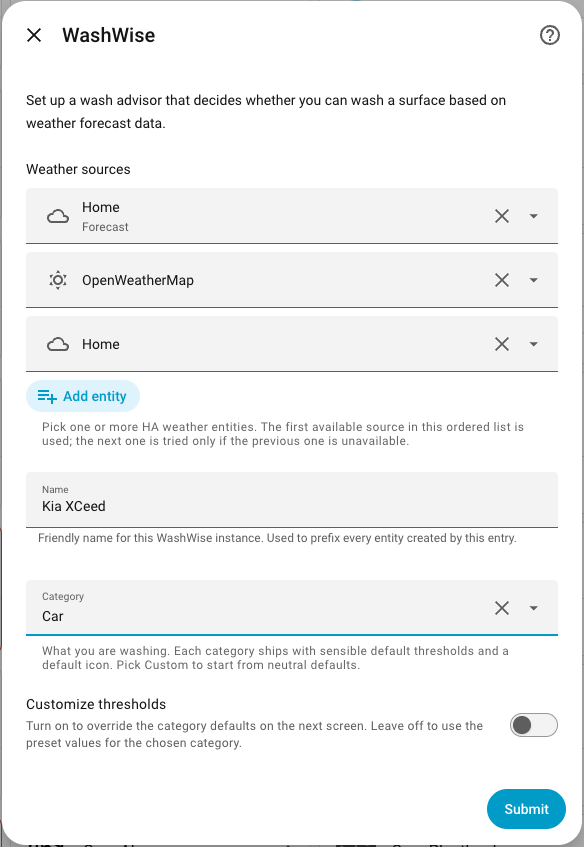
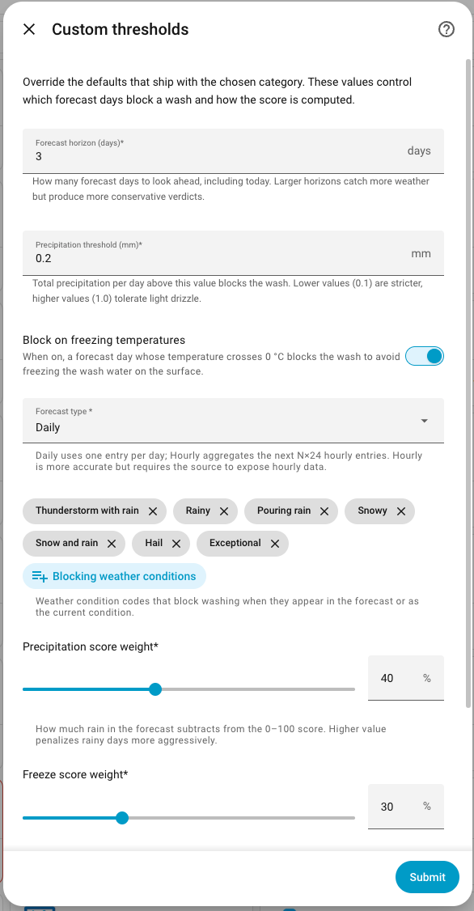
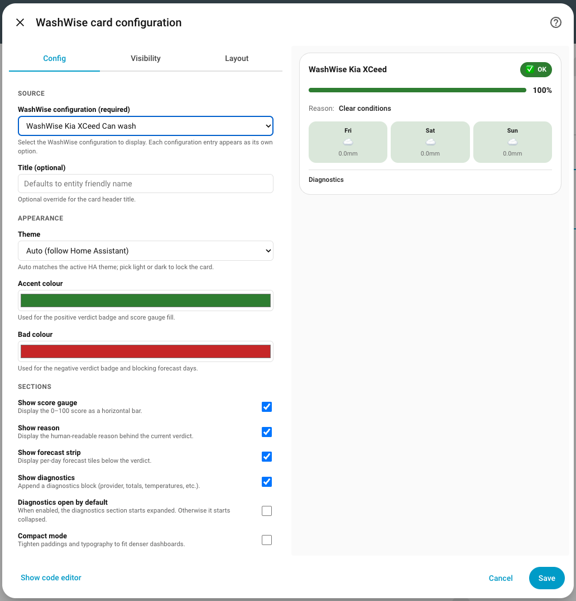
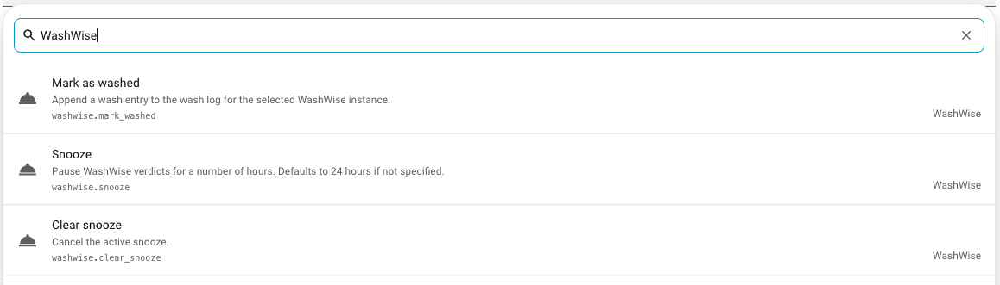

# WashWise for Home Assistant

<a href="https://github.com/italo-lombardi/Home-Assistant-WashWise/releases"></a>
<a href="https://github.com/hacs/integration"></a>
<a href="https://www.home-assistant.io/"></a>
<a href="https://github.com/italo-lombardi/Home-Assistant-WashWise/blob/main/LICENSE"></a>


[](https://my.home-assistant.io/redirect/hacs_repository/?owner=italo-lombardi&repository=Home-Assistant-WashWise&category=integration)
[](https://my.home-assistant.io/redirect/config_flow_start/?domain=washwise)

Decide whether to wash your car (or motorcycle, boat, solar panels, patio…) based on the weather forecast. WashWise reads any Home Assistant `weather` entity, walks an ordered fallback list of sources, and produces a verdict, a 0–100 score, a blocking reason, and per-day breakdown — all wrapped in a custom Lovelace card.

---

## Screenshots

| Card — OK | Card — Snoozed |
|:---------:|:--------------:|
|  |  |

| Controls & Sensors | Diagnostics |
|:-----------------:|:-----------:|
|  |  |

| Config flow — step 1 | Config flow — thresholds |
|:--------------------:|:------------------------:|
|  |  |

| Card editor | Actions |
|:-----------:|:-------:|
|  |  |

---

## Features

- **Generic weather model** -- any HA `weather` entity works, no per-provider code
- **Ordered fallback** -- list multiple weather sources; first available wins, failovers persisted
- **0–100 score** -- weighted sum of precipitation, freeze, and bad-condition penalties
- **Nine categories** -- Car, Motorcycle, Bicycle, Boat, RV, Windows, Solar Panels, Patio, Custom — each with sensible preset thresholds
- **Solar panel inversion** -- rain *helps* clean panels; verdict flips automatically
- **Smart auto-recalc** -- coordinator recomputes the moment the active weather entity changes state
- **Snooze** -- pause the verdict for N hours via service call; countdown sensor included
- **Wash log** -- mark washes manually; days-since and 30-day count tracked in persistent storage
- **Provider health** -- success/failure counters and uptime percentage per weather source
- **Custom Lovelace card** -- verdict, score, forecast strip, diagnostics panel, visual editor
- **HACS-installable**, 11 backend languages, 100% test coverage gate in CI

---

## Installation

### HACS (Recommended)

1. Open HACS in your Home Assistant instance.
2. Go to **Integrations** and click the three-dot menu.
3. Select **Custom repositories**.
4. Add `https://github.com/italo-lombardi/Home-Assistant-WashWise` with category **Integration**.
5. Click **Install** and restart Home Assistant.

### Manual

1. Download the [latest release](https://github.com/italo-lombardi/Home-Assistant-WashWise/releases).
2. Copy the `custom_components/washwise/` folder into your `config/custom_components/` directory.
3. Restart Home Assistant.

---

## Configuration

This integration uses a config flow accessible from **Settings > Devices & Services > Add Integration > WashWise**.

### Step 1: Weather sources & basics

| Field | Description |
|-------|-------------|
| Weather entities | One or more HA `weather.*` entities in priority order. First available is used; rest are fallbacks. |
| Name | Optional friendly name (e.g. "Daily driver"). Entity IDs become `sensor.washwise_<name>_*`. |
| Category | One of nine categories (see [Categories](#categories) below). Default: Car. |
| Customize thresholds | Toggle on to override the category preset in the next step. |

### Step 2 (optional): Thresholds

Visible only when **Customize thresholds** is on. Pre-filled from the selected category preset.

| Field | Description |
|-------|-------------|
| Horizon (days) | How many forecast days to analyse (0–7). |
| Precipitation cutoff (mm) | Any day above this value blocks the verdict. |
| Freeze check | Block when any forecast day crosses 0 °C. |
| Score weights | Independent weights for precipitation, freeze, and bad-condition penalties. |

### Reconfigure & options

All settings can be edited after creation via **Settings > Devices & Services > WashWise > Configure**.

The **Advanced** step includes a **Temperature unit** override. Leave it on **Auto** unless your weather provider sends Fahrenheit values without tagging them (you'll see e.g. `145 °F` in the min/max sensors — set the override to Fahrenheit to fix it).

---

## Categories

| Category | Horizon | Precip cutoff | Freeze check | Inverted |
|----------|---------|---------------|--------------|----------|
| Car | 3 d | 0.2 mm | yes | no |
| Motorcycle | 2 d | 0.5 mm | yes | no |
| Bicycle | 2 d | 0.8 mm | no | no |
| Boat | 5 d | 0.1 mm | yes | no |
| RV / Camper | 5 d | 0.1 mm | yes | no |
| House windows | 1 d | 1.0 mm | no | no |
| Solar panels | 0 d | 0.0 mm | no | **yes** |
| Patio / deck | 2 d | 0.5 mm | no | no |
| Custom | 3 d | 0.2 mm | yes | no |

Solar panels invert the verdict — when rain is forecast the integration reports "self-cleaning expected" rather than "wash now".

---

## Entities created

All entities live under a single **WashWise \<name\>** device per config entry.

### Binary sensors

| Entity | Description |
|--------|-------------|
| `binary_sensor.washwise_<name>_can_wash` | Primary verdict. Attributes: `forecast_summary`, `decision_details`, `days_analyzed`, `score`, `reason`, `active_weather_entity`. |
| `binary_sensor.washwise_<name>_day_N_ok` | Per-day verdict for each day in the horizon (max 7). |
| `binary_sensor.washwise_<name>_freeze_risk` | Diagnostic: ON when the forecast crosses 0 °C. |

### Sensors

| Entity | Description |
|--------|-------------|
| `sensor.washwise_<name>_score` | 0–100 wash score. |
| `sensor.washwise_<name>_reason` | Reason key: `clear` / `rain` / `freeze` / `snow` / `bad_condition` / `bad_current_condition` / `snoozed` / `unavailable`. |
| `sensor.washwise_<name>_days_until_wash` | Whole-day count to first clear window. `0` means today. |
| `sensor.washwise_<name>_days_since_wash` | Days since the last wash log entry. |
| `sensor.washwise_<name>_last_washed` | Timestamp of the most recent wash log entry. |
| `sensor.washwise_<name>_wash_count_30d` | Wash log entries in the last 30 days. |
| `sensor.washwise_<name>_active_provider` | Friendly label of the active weather source. Attribute: `weather_entity_id`. |
| `sensor.washwise_<name>_last_update` | Timestamp of the last successful coordinator refresh. |

### Diagnostic sensors

| Entity | Description |
|--------|-------------|
| `sensor.washwise_<name>_category` | Configured category key (e.g. `car`, `boat`). |
| `sensor.washwise_<name>_days_analyzed` | Forecast days that made it through normalisation. |
| `sensor.washwise_<name>_precip_total_mm` | Sum of precipitation across the analysed horizon. |
| `sensor.washwise_<name>_worst_condition` | Most adverse condition code seen in the horizon. |
| `sensor.washwise_<name>_min_temp` | Minimum forecast temperature (°C). |
| `sensor.washwise_<name>_max_temp` | Maximum forecast temperature (°C). |
| `sensor.washwise_<name>_primary_provider_uptime` | Success ratio of the primary weather source (%). |
| `sensor.washwise_<name>_snooze_remaining` | Minutes left on an active snooze, or Unknown when not snoozed. |
| `sensor.washwise_<name>_day_N_score` | Per-day score (0–100) for each horizon day. |

### Buttons

| Entity | Action |
|--------|--------|
| `button.washwise_<name>_mark_washed` | Append a manual entry to the wash log. |

---

## How the score is calculated

The score starts at 100 and subtracts points for each forecast day in the horizon:

```
for day in horizon:
    score -= precip_weight   × normalised_precip(day)
    score -= freeze_weight   × (1 if day crosses 0 °C else 0)
    score -= condition_weight × BAD_CONDITION_SEVERITY[condition]
score = clamp(0, 100, score)
```

The `can_wash` verdict is independent — it goes **off** the moment any day breaches the precipitation threshold, freeze check, or a blocking condition. The score reflects *how confident* WashWise is in saying yes or no.

Default weights: precipitation 40, freeze 30, bad condition 30. All three are configurable in **Options > Customize thresholds**.

---

## Services

| Service | Description |
|---------|-------------|
| `washwise.mark_washed` | Append a wash entry. Optional `timestamp` (defaults to now). |
| `washwise.snooze` | Pause the verdict for `hours` (integer, minimum 1). |
| `washwise.clear_snooze` | Cancel any active snooze and return to the normal verdict. |

All services require an `entry_id` field targeting the WashWise config entry (visible in Developer Tools → Actions).

---

## Lovelace card

The custom card auto-registers when the integration loads. Add it to a dashboard with:

```yaml
type: custom:washwise-card
entity: binary_sensor.washwise_daily_driver_can_wash
```

Full options:

```yaml
type: custom:washwise-card
entity: binary_sensor.washwise_daily_driver_can_wash
name: My Honda Civic          # optional title override
theme: auto                   # auto | light | dark
accent_color: "#2e7d32"
bad_color: "#c62828"
show_score_gauge: true
show_reason: true
show_forecast_strip: true
show_diagnostics: true
diagnostics_open: false       # start diagnostics section expanded
compact_mode: false
```

All options are configurable via the visual card editor.

---

## Adding a new weather provider

WashWise has no per-provider adapter. Anything that exposes a HA `weather` entity and serves `weather.get_forecasts` is supported automatically.

1. Install the provider in HA so a `weather.*` entity appears.
2. Verify `weather.get_forecasts` returns a non-empty `forecast` list (Developer Tools → Actions).
3. Add the entity to your WashWise config in **Settings > Devices & Services > WashWise > Configure > Providers**.

If the provider uses a precipitation or temperature key not in the built-in fallback list, [open an issue](https://github.com/italo-lombardi/Home-Assistant-WashWise/issues) with a sample payload — adding it is a one-line `const.py` edit.

---

## FAQ

**Q: All sensors show `unavailable` right after install.**
A: The coordinator needs one successful update. Call `washwise.snooze` with `hours: 0` is invalid — just wait for the first weather entity state change, or trigger a reload from the integration page.

**Q: Min / max temperature shows values in °F.**
A: The provider sends Fahrenheit without tagging the unit. Open **Configure → Advanced** and switch **Temperature unit** from Auto to Fahrenheit.

**Q: Solar panels says "wash now" when it's sunny.**
A: That is the inverted-logic category working as intended — clear weather means panels stay dirty. Switch to **Custom** if you want non-inverted behaviour.

**Q: `precip_total_mm` is always 0.**
A: The provider uses a precipitation key not in the fallback list. Open an issue with the `weather.get_forecasts` payload.

**Q: How do I monitor failovers?**
A: `sensor.washwise_<name>_active_provider` shows which source is active. `primary_provider_uptime` shows the health ratio.

---

## Contributing

Contributions are welcome! Please:

1. Fork the repository.
2. Create a feature branch (`git checkout -b feature/my-feature`).
3. Commit your changes with clear commit messages.
4. Open a Pull Request against `main`.

### Development Setup

```bash
git clone https://github.com/italo-lombardi/Home-Assistant-WashWise.git

python -m venv venv
source venv/bin/activate

pip install homeassistant pytest pytest-homeassistant-custom-component freezegun
```

### Running Tests

```bash
python -m pytest tests/ -v
```

### Guidelines

- Follow the [Home Assistant integration development guidelines](https://developers.home-assistant.io/).
- Add translations for any new user-facing strings.
- Write tests for new functionality.
- Keep PRs focused — one feature or fix per PR.

---

## Sibling integrations

- [Entity Availability](https://github.com/italo-lombardi/Home-Assistant-EntityAvailability) — track offline entities, availability history, and degraded states with a custom dashboard card.
- [Entity Guard](https://github.com/italo-lombardi/Home-Assistant-EntityGuard) — enforce entity state via declarative rules — replaces hand-written auto-off / auto-lock automations.
- [Entity Distance](https://github.com/italo-lombardi/Home-Assistant-EntityDistance) — distance, direction, and ETA between 2–5 HA entities.
- [Fuel Compare](https://github.com/italo-lombardi/Home-Assistant-FuelCompare) — live fuel prices from fuelcompare.ie.

---

## License

MIT. See `LICENSE`.
